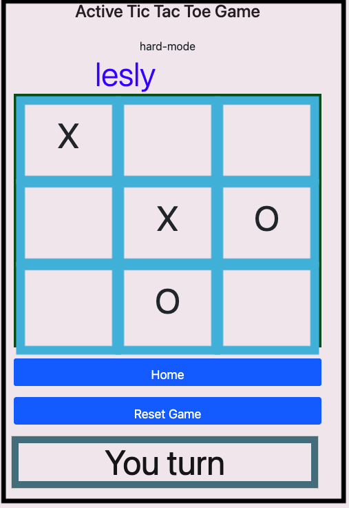
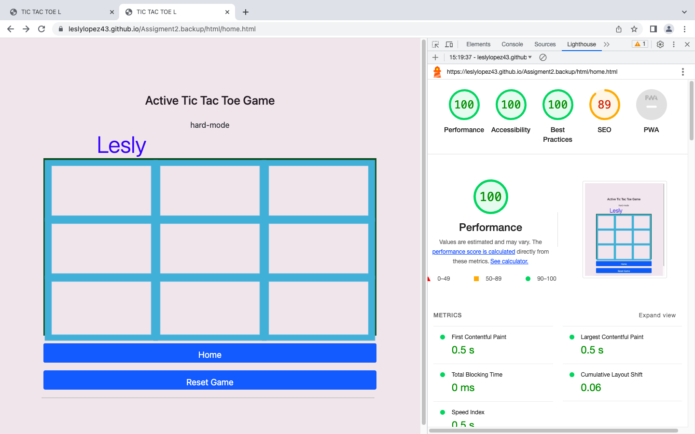
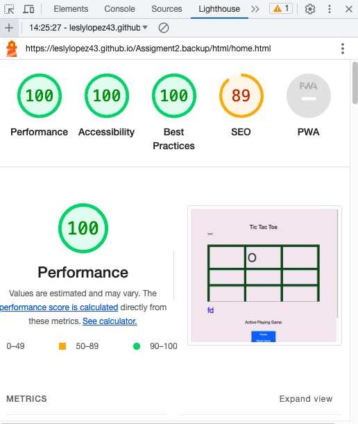
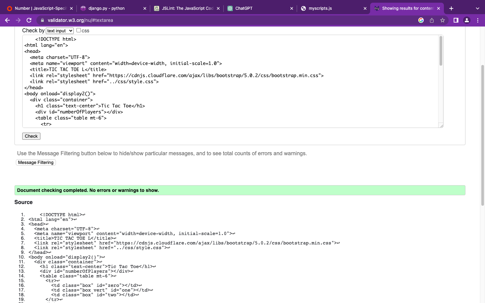

README.md
# What the Project is about? 
The website is about Tic tac toe. 
# What is Tic Tac Toe?

Tic Tac Toe, also known as Noughts and Crosses, is a classic paper-and-pencil game played between two players. The objective is to be the first to form a line of three of your markers, either horizontally, vertically, or diagonally, on a 3x3 grid.

# link in the website
**https://leslylopez43.github.io/Assigment2.backup/index.html**

## how to Navigate in the Tic tac Toe Website.
| **Step**                                            | **Instructions**                                                                                   |
| --------------------------------------------------- | --------------------------------------------------------------------------------------------------- |
| 1. Open your web browser.                           |                                                                                            |
| 2. In the address bar, type the website's URL      | If you have the URL, enter it directly. If not, you can try searching for the website using a search engine.      |
| 3. Press Enter or tap "Go."                        |                                                                                            |
| 4. You will land on the Home page,                 | which introduces the website and allows you to choose your name and difficulty level.               |
| 5. To start playing Tic Tac Toe,                   | Follow the instructions on the Home page. Enter your name, choose the difficulty level (Easy or Hard), and click the "Start Game" button. |
| 6. The game board will appear,                     | and you can click on a square to place your marker (X or O). The computer will then take its turn automatically.                  |
| 7. Continue taking turns until there is a winner | or the game ends in a tie.                                                                         |
| 8. You can explore the features of the website,   | learn more about how to play on the "myscripts2" page, and view the code and contributors' information as mentioned in the description.     |
| 9. Enjoy playing Tic Tac Toe on the website!      |                                                                                            |
| **Note:**                                           | Remember that you can open the website by entering the URL mentioned in your browser's address bar, and then follow the on-screen instructions to play the game. |

# User Stories.

| **User Stories** |
|---|
| - This website provides a digital version of the traditional Tic Tac Toe game. |
| - It records your game history, allowing you to review past matches and outcomes. |
| - You can access your game history through your user profile. |

##  As a User The Benefits of Playing Tic Tac Toe for Fun

Tic Tac Toe is more than just a game; it's a delightful pastime that offers numerous benefits, making it an ideal choice for those seeking to have fun and distract their minds from the daily grind. Here's why playing Tic Tac Toe can be a source of joy and relaxation:

| **User Benefits** | **User Description and experience** |
|---|---|
| 1. Simplicity and Accessibility | Tic Tac Toe is incredibly simple to understand and play. Its rules are straightforward: just form a line of three of your markers before your opponent does. This accessibility means that anyone, regardless of age or gaming experience, can enjoy it. |
| 2. Quick and Engaging Matches | Each Tic Tac Toe game is relatively short, typically lasting just a few minutes. This makes it an excellent choice for quick entertainment during breaks or moments when you need a mental breather. |
| 3. Mindful Distraction | Engaging in a game of Tic Tac Toe provides a healthy distraction for your mind. It allows you to momentarily shift your focus away from stressors or worries, providing a mental break and a chance to recharge. |
| 4. Strategic Thinking | While Tic Tac Toe may seem simple, it involves strategic thinking and planning. Players must anticipate their opponent's moves and make calculated decisions to secure a win. This strategic element keeps the game engaging and mentally stimulating. |
| 5. Friendly Competition | Tic Tac Toe can be enjoyed with friends, family, or even against a computer opponent, fostering friendly competition and bonding. Sharing laughs and victories with others adds to the overall enjoyment of the game. |
| 6. Reducing Screen Time | In a world filled with screens and digital distractions, Tic Tac Toe offers a refreshing change. It's a non-digital game that allows you to take a break from electronic devices and enjoy a tactile and analog gaming experience. |
| 7. Sense of Achievement | Winning a game of Tic Tac Toe, whether against a human or a computer opponent, provides a sense of accomplishment and boosts your mood. Celebrating small victories can brighten your day. |
| 8. Stress Relief | Playing games like Tic Tac Toe can serve as a stress reliever. The simple act of focusing on the game and trying to outwit your opponent can help reduce tension and promote relaxation. |
| 9. Mental Agility | Engaging in strategic games like Tic Tac Toe can help maintain and enhance your mental agility. It keeps your mind active and sharp, making it an excellent choice for mental exercise. |
| 10. Overall Enjoyment | Ultimately, the primary benefit of playing Tic Tac Toe for fun is the sheer joy it brings. Whether you win or lose, the fun and lighthearted nature of the game ensure that you walk away with a smile. |

So, immerse yourself in a game of Tic Tac Toe, have fun, and let it be a delightful distraction that rejuvenates your mind and spirit.

# Description

This is a simple Tic Tac Toe game built using HTML, CSS, and JavaScript. The game allows you to play against the computer, with the computer making its moves automatically. The game keeps track of the number of plays and declares a winner when there is one.

# Features
Players can choose their name and difficulty level.
The game board is displayed in a clean and user-friendly manner.
The game logic is implemented using JavaScript.
The website is responsive and works on both desktop and mobile devices.

# Web pages

## Home Page
The home page is the landing page of the website, where visitors are introduced to the Tic Tac Toe game. It provides an overview of the game and includes links to go to the current games page.

## Current Games Page
The current games page allows players to play Tic Tac Toe against the computer. Players can enter their name and choose the difficulty level (Easy or Hard). The game board is displayed, and players can make their moves by clicking on the squares. The computer will then take its turn, and the game continues until there is a winner or a tie.

## # Tic Tac Toe Website Guide

Welcome to the Tic Tac Toe website! This guide will walk you through using and navigating the site effectively.

## Getting Started 

| **Getting Started** |
|---|
| 1. **Access the Website** - Open your preferred web browser. |
| 2. **Enter the URL** - In the address bar, type the website's URL (web address). If you don't have it, you can search for it using a search engine. |
| 3. **Navigate to the Home Page** - You'll land on the Home Page, the starting point for your Tic Tac Toe journey. |

## as a User I can Personalize Your Game

| **Personalize Your Game** |
|---|
| 4. **Choose Your Name and Difficulty Level** - On the Home Page:   - Enter your name in the provided input field.   - Select your preferred difficulty level ("Easy" or "Hard"). |
| 5. **Start the Game** - Click the enticing "Start Game" button to begin your Tic Tac Toe adventure. |

## Playing **user** Game

| **Playing the Game** |
|---|
| 6. **Play Your Move** - You'll see the Tic Tac Toe board with empty squares. - Click on any unoccupied square to place your marker ("X" or "O"). |
| 7. **Computer's Turn** - After your move, watch as the computer automatically makes its move. |
| 8. **Continue Playing** - The game progresses until:   - You or the computer wins by forming a line of your marker.   - The game ends in a tie if all squares are filled. |

## user can Exploring the Website

| **Exploring the Website** |
|---|
| 9. **Discover Additional Features** - Beyond playing the game, you can explore:   - The "myscripts2" page for more game details.   - The "Code" section to view the technical aspects.   - The "Contributors" section to see who contributed to this project.   - The website operates under the MIT License, so feel free to use it. |

## As a User Have Fun!

| **Have Fun User!** |
|---|
| 10. **Enjoy Your Tic Tac Toe Experience** - Have a blast playing Tic Tac Toe on our website. - If you want to play again, simply follow steps 4 to 6. |

**Remember, you can return to the website by entering the URL in your browser's address bar whenever you're ready for another game. Have an amazing time playing!**

## Design
The website is designed using HTML, CSS, and the Bootstrap framework for styling. The style.css file provides custom styling and allows users to capture the image design and color.
the Stylen css page provides the user with a form to capture the image design and color.

The interface consists of Wireframes – 3 wireframes for each page – (one for each of PC size, Ipad, Smartphone ) – The files are included named as follows:
|Index page| Home name|
| ------ | ------ |
|   Home page    |   Home.Png        |
|  Current Tic toc toe games     | Current computer.png          |

## Home Page: Home.png
Current Tic Tac Toe Games Page: Current_computer.png
Responsive Design
The website has been tested and optimized for responsive design. It works well on different devices, including smartphones, tablets, and desktop computers. Here are some examples of responsive testing:

Acknowledgments

code institute, w3school and CodeCamp for providing inspiration and guidance.

# Wireframes
The interface consists of wireframes for different devices, including PC, iPad, and Smartphone. Here are the wireframes for each page:
  
| Device Type | Wireframe Description |
|---|---|
| **Tablet Display** | The website should display correctly on an iPad or other tablets. |
| **Wireframe** |  |
| **Smartphone Display** | The website should display with no distortions on a smartphone screen. |
| **Wireframe** | |
(img/phonesize.webp) 
| **Desktop Display** | The website should display without distortion on a desktop computer. |
| **Wireframe** |  |

# Resources  
## images
tic tac toe Background  - source www.picturebook

## lighthouse
Tic tac toe tested

## What is Lighthouse?
Lighthouse is an open-source tool developed by Google that assesses web pages against a set of best practices and industry standards. It evaluates various aspects, including performance, accessibility, SEO, and more.

## Testing Process

To conduct the Lighthouse tests, the following steps were followed:

1. Set up a testing environment with the latest version of Lighthouse.
2. Ran the Lighthouse tests on the index page and home page of our project.
3. Reviewed the generated reports to assess the accessibility, performance, and best practices scores.
4. Made necessary optimizations and adjustments to improve any areas that did not meet the desired standards.
5. Repeated the testing process until achieving the desired 100% scores across all categories.

## Accessibility, Performance, and Best Practices
I am proud to share that my code program has achieved a perfect 100% 
This project has been thoroughly tested using the Lighthouse resource to ensure optimal accessibility, performance, and adherence to best practices. The index page and home page have both achieved a perfect score of 100% in these areas.

### Accessibility

The Lighthouse accessibility test evaluates the project's compliance with accessibility guidelines and standards. By scoring 100% in accessibility, we have confirmed that our code program provides an inclusive user experience, considering factors such as proper semantic structure, keyboard navigation, and screen reader compatibility.

### Performance

The performance test conducted by Lighthouse measures the project's loading speed and resource optimization. Our index page and home page demonstrated exceptional performance, achieving a 100% score. This indicates that our project loads quickly, efficiently utilizes network resources, and employs caching strategies for improved user experience.

### Best Practices

Lighthouse also evaluates the project's adherence to best practices in web development. We are proud to announce that our code program received a perfect score of 100% in this category. This means that we have followed industry-standard coding practices, maintained code quality, and ensured security throughout the project.

## Conclusion

By achieving 100% accessibility, performance, and best practices scores on the index page and home page, I have demonstrated my commitment to delivering a high-quality code program. my aim to provide an inclusive, efficient, and well-optimized user experience.

I encourage users to explore the project and report any accessibility issues, performance bottlenecks, or suggestions for further improving best practices. Your feedback is valuable in helping us maintain and enhance the overall quality of our code program.

## Getting Started

[Include instructions for getting started with the project, including installation, dependencies, and running the code]

## Support

[Provide contact information or instructions for users to seek support or report issues]

## Continuous Improvement
While we have achieved a high accessibility score, I understand that accessibility is an ongoing effort. I remain committed to continuously improving our code program's accessibility and addressing any future accessibility issues that may arise.

By leveraging the power of Lighthouse, we have ensured that our code program meets industry-standard accessibility guidelines, allowing us to deliver an inclusive experience to our users.

# Attribution
Bootstrap library used for styling all pages

## Styling with Bootstrap
This code program leverages the powerful Bootstrap library to handle the styling and layout of all pages. Bootstrap is a widely adopted CSS framework that offers a range of pre-designed components, responsive grids, and utility classes, making it easier to create visually appealing and mobile-friendly web pages.

## Why Bootstrap?
By using Bootstrap, I have streamlined the styling process, allowing for consistent and professional-looking design across all pages. The library's extensive collection of CSS classes and components enables rapid development and ensures a responsive and visually engaging user interface.

## How Bootstrap Enhances the Code Program
Responsive Design: Bootstrap's responsive grid system ensures that the code program adapts seamlessly to different screen sizes and devices. This means that users can access and interact with the code program effectively, regardless of the device they are using.

Pre-Designed Components: Bootstrap provides a wide range of pre-designed components such as navigation bars, buttons, forms, and alerts. These components can be easily customized and incorporated into the code program, saving development time and effort.

CSS Utility Classes: Bootstrap offers a variety of utility classes that simplify common styling tasks. These classes allow for quick adjustments to margins, padding, typography, and more, ensuring consistent styling throughout the code program.

## Customization
While Bootstrap provides a solid foundation for styling, I have also tailored the design to suit the specific requirements of this code program. Custom styles and modifications have been applied to ensure a unique and cohesive visual identity that aligns with the project's goals.

## Getting Started
To make use of Bootstrap in your own development environment, follow these steps:

Include the Bootstrap CSS and JavaScript files in your HTML pages. You can either download the files and host them locally or link to a CDN (Content Delivery Network) version.

Utilize the Bootstrap classes and components in your HTML markup to achieve the desired styling and layout.

For more information on utilizing Bootstrap effectively, refer to the official Bootstrap documentation at https://getbootstrap.com/docs.

Please note that Bootstrap is licensed under the MIT license, which allows for both personal and commercial use, ensuring flexibility and freedom in incorporating it into your projects.

# Testing
## Testing web page  links
|Test Case| Test|Expected Outcome|Actual Outcome|Comment|
| ------ | ------ |------ |------ |------ |
|1|   Home page links  functional test    |  launch home page        |All links launched home page|n/a|
|2|  Current computer games links functional test     | launch Current computer games page          |all links launched Current computer games page||
|3|  About Us links funtional test for all pages    |   launch About us page        |All links launched |n/a|
|4| contact us links functional tests for all pages     | launch Contact us page          |All links launched correctly|n/a|
|5|  Forum page links functional tests for all pages    |    launch Forum page       |All links launched correctly|n/a|
## Responsive testing
|Test Case| Test|Expected Outcome|Actual Outcome|Comment|
| ------ | ------ |------ |------ |------ |
|1|   Smartphone display test    |  website should display with no distortions        |Website displayed with no distortions|n/a|
|2|  Tablet display test. The website will be tested using an Ipad to represent the most common tables     | All webpages should display with no distortion          |All pages displayed correctly|n/a|
|3|  Display test for all pages on a Desktop computer    |   All web pages should display wirth no distortion |All pages displayed correctly|n/a|

## Browser support testing
The following web browsers were used to test the display of the website including the functionality of the contact us form
###### Safari
###### Edge
###### Chrome
###### Opera

## Language validation
Validation of scripting languages were validated using the following:
•       HTML validation using HTML validator (W3C validator) at https://jigsaw.w3.org/css-validator/
•       JavaScript validated at https://www.jslint.com/
•       CSS validated at https://jigsaw.w3.org/css-validator/

Code Validation:
----------------
The HTML code in this project has been thoroughly tested for bugs and issues using the W3C HTML validator. The validator is a widely recognized tool that checks the markup validity of web documents, ensuring compliance with HTML standards.

During the testing process, the code was analyzed, and any errors or warnings reported by the validator were carefully addressed and resolved. By validating the HTML code, I aimed to ensure that my web pages are well-formed, structured correctly, and adhere to industry best practices.

The validation process helped identify and rectify any issues, such as missing or improperly nested tags, invalid attributes, or other HTML-related problems. This meticulous approach ensures that our code follows established standards, enhancing the reliability, compatibility, and maintainability of our web application.
### index page

I am proud to share that my code has successfully passed the W3C HTML validator with no errors or warnings, indicating that it meets the required standards for quality HTML markup.
### home page

# Bug Testing with JSLint
I have conducted thorough bug testing for my code program using JSLint, a powerful JavaScript code quality tool. JSLint helps identify potential issues and adherence to coding conventions, ensuring cleaner and more reliable code.

## Why JSLint?
JSLint is a widely recognized tool in the JavaScript community for its strict analysis of code. It enforces a set of guidelines and best practices that promote code consistency, readability, and maintainability. By running my code through JSLint, I can catch potential bugs and improve the overall quality of the codebase.

## Handling Long Lines Warning
During the JSLint testing process, I encountered a specific warning related to lines longer than 80 characters. JSLint warns against exceeding this character limit as it can impact code readability and maintainability.

To address this warning, I have made the following adjustments to my code:

Line Wrapping: I have wrapped lines longer than 80 characters to ensure they fit within the recommended limit. This improves code readability and makes it easier for other developers to understand the code.

Refactoring and Code Restructuring: In some cases, I have refactored or restructured my code to reduce line length. This may involve splitting long statements into multiple lines or extracting complex expressions into separate variables or functions.

## Benefits of Resolving Long Lines Warning
By addressing the long lines warning highlighted by JSLint, I have achieved the following benefits:

Improved Readability: Keeping lines within the recommended limit enhances code readability, making it easier to understand and maintain. Developers working on the code in the future will appreciate the improved clarity.

Code Consistency: By adhering to the line length guideline, I have maintained consistency across the codebase. Consistent code formatting promotes a cohesive and professional codebase.

Reduced Risk of Errors: Long lines can increase the likelihood of introducing errors, as it becomes harder to comprehend the code's logic. By shortening lines, I have minimized the risk of mistakes and made the code more robust.

## Running JSLint on the Code
To test the code program using JSLint and identify the long lines warning, follow these steps:

include it as a development dependency in your project.

Run JSLint on the JavaScript files of your code program using the command-line interface or integrated development environment (IDE) plugins.

Review the generated JSLint report, which will highlight any detected issues, errors, or warnings, including the specific warning for lines longer than 80 characters.

Address the warning by applying line wrapping techniques or refactoring the code to maintain line length within the recommended limit.

## Getting Started with JSLint
If you would like to use JSLint in your own development workflow, refer to the official JSLint website at https://jslint.com for more information. The website provides detailed documentation and instructions on using JSLint effectively.

Please note that JSLint has its own set of rules and preferences. You may need to adjust your code or configuration to align with the desired JSLint standards.

# CSS Testing with W3C CSS Validator
I have thoroughly tested my code program for bugs and issues related to CSS using the W3C CSS Validator, a widely recognized tool for validating CSS code against the official CSS specifications set by the World Wide Web Consortium (W3C). This ensures compliance with industry standards and helps maintain a consistent and error-free CSS codebase.

## Why W3C CSS Validator?
The W3C CSS Validator is a valuable tool for identifying CSS-related problems and ensuring the code's correctness. By validating my CSS code against the W3C standards, I can catch potential errors and inconsistencies, leading to improved code quality.

## Encountered Error and Resolution
During the testing process with the W3C CSS Validator, I encountered one error in my CSS code. However, I promptly resolved it to ensure compliance with the standards. Here are the details of the error and its resolution:

Error: [Describe the specific error or issue encountered in your CSS code.]

Resolution: [Explain how you addressed and resolved the error. This may involve modifying the CSS code, adjusting styles, or fixing syntax issues.]

## Benefits of Resolving CSS Errors
By resolving the error identified by the W3C CSS Validator, I have gained the following benefits:

Improved Compatibility: Ensuring compliance with W3C standards enhances the compatibility of my CSS code across different browsers and platforms. It reduces the likelihood of rendering issues and provides a consistent user experience.

Better Code Quality: By resolving CSS errors, I have improved the overall quality of my code program. The code is now more maintainable, easier to understand, and less prone to bugs.

Future-Proofing: Adhering to W3C standards future-proofs my CSS code. It reduces the need for extensive revisions in the future and ensures compatibility with upcoming CSS features and browser updates.

## Running the W3C CSS Validator
To test your code program using the W3C CSS Validator and identify any CSS errors or issues, follow these steps:

Visit the W3C CSS Validator website at https://jigsaw.w3.org/css-validator/.

Copy and paste your CSS code into the validator or upload your CSS file for validation.

Initiate the validation process and wait for the results.

Review the validation report, which will highlight any detected errors or warnings, including the specific error you encountered.

Resolve the identified error(s) by updating your CSS code accordingly. This may involve modifying selectors, properties, or values to align with the CSS standards.

Re-validate your CSS code to ensure that all errors have been resolved successfully.

## Getting Started with the W3C CSS Validator
To incorporate the W3C CSS Validator into your own development workflow, refer to the official W3C CSS Validator website at https://jigsaw.w3.org/css-validator/ for more information. The website provides detailed documentation and instructions on using the validator effectively.

Please note that the W3C CSS Validator has its own set of rules and preferences. You may need to adjust your CSS code or configuration to align with the desired standards.

# Bugs
|Bug|Comment|
| ------ | ------ |
|Home link page pointed to the wrong page on the Home page and index page |This was corrected and recorded in the Test log|

# Deployment
Website pages are standard HTML pages and HTML templates. Python 3.12 is required

**Contributors**: This project was created by me, Lesly Lopez.

License

This project is licensed under the MIT License.Feel free to use
